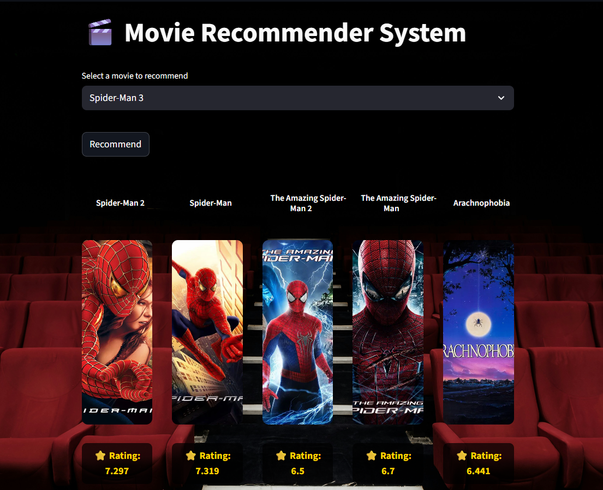

# 🎬 MovieGenie — Movie Recommender System

A content-based Movie Recommender System built using **Machine Learning** and deployed with **Streamlit Cloud**.  
This application suggests movies similar to the one selected by the user and displays movie posters along with ratings using an external API.

---

## 🚀 Live Demo
👉 **Try the App:**  
https://moviegenie.streamlit.app

---

## 📌 Project Overview
MovieGenie is a Movie Recommendation Web App that helps users discover new movies based on similarity scores. The system uses a precomputed similarity matrix and integrates with the TMDB API to fetch movie posters and ratings.

This project demonstrates:
- Machine Learning concepts
- API Integration
- Web App Development
- Cloud Deployment

---

## ✨ Features
✔ Recommend similar movies  
✔ Displays movie posters  
✔ Shows movie ratings  
✔ Responsive layout for all devices  
✔ Clean and user-friendly interface  
✔ Fast performance using precomputed similarity matrix  

---

## 🛠 Tech Stack
- Python
- Pandas
- Scikit-learn
- Streamlit
- Pickle
- Requests
- gdown
- TMDB API

---

## 📂 Project Structure

```
movie-recommender-system/
│
├── app.py
├── similarity.pkl
├── movie_dict.pkl
├── requirements.txt
└── README.md
```


## ⚙️ Installation (Run Locally)

### 1️⃣ Clone the Repository
```bash
git clone https://github.com/your-username/movie-recommender-system.git
cd movie-recommender-system
```
### 2️⃣ Install Dependencies
```bash
pip install -r requirements.txt
```
### 3️⃣ Run the App
```bash
streamlit run app.py
```
---
## 🌍 Deployment (Streamlit Cloud)
1.Push your project to GitHub

2.Visit Streamlit Cloud

3.Click New App

4.Select your repository

5.Set
```bash 
Branch → main
Main file → app.py
```
6.Click Deploy

---

## 📊 How It Works
User selects a movie

System calculates similarity scores

Top 5 related movies are selected

Posters and ratings are fetched via API

Results are displayed in UI

---
## 🧠 Machine Learning Concept
This project uses:

->Text Vectorization

->Cosine Similarity

->Precomputed Similarity Matrix

---

## 📸 Screenshots

### Recommendations Page



---
## 🔮 Future Improvements
  Add movie overview

Add genre filtering

Add search functionality

Add trailer integration

Improve recommendation algorithm

Add user login & favorites

---

## 📚 Libraries Used

streamlit
pandas
requests
pickle
gdown
scikit-learn

---

## 👨‍💻 Author
Badagala Bharath Kumar
Machine Learning Enthusiast
B.Tech Student
